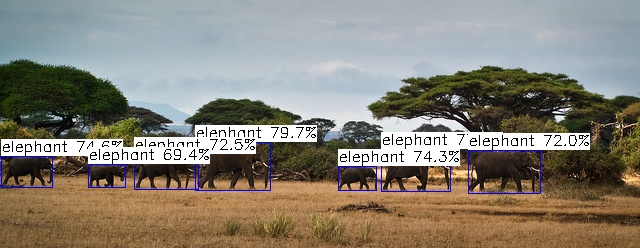

# DAMO-YOLO-NCNN
 Deploy DAMO-YOLO by NCNN.
## 1. Export to ONNX
Use following commands to export Pytorch model to ONNX model:
```
cd damo-yolo
python converter.py --config_file path-to-config-file --benchmark --ckpt path-to-ckpt --batch_size 1 --img_size 416 --opset 12
```
**--benchmark** is required, other parameters can be changed according to the actual situation.
## 2. Convert ONNX to NCNN
Use the executable file "onnx2ncnn.exe" to convert ONNX model to NCNN model:
```
path-to-onnx2ncnn.exe path-to-damoyolo.onnx path-to-damoyolo.param path-to-damoyolo.bin
```
Optionally, you can use fp16 to save and inference model by this command:
```
path-to-ncnnoptimize.exe path-to-damoyolo.param path-to-damoyolo.bin path-to-damoyolo-opt.param path-to-damoyolo-opt.bin 65536
```
## 3. Inference NCNN model 
Load and inference NCNN models as the way in **damo-yolo.cpp**. Here is an example of detection result:


See more details in 